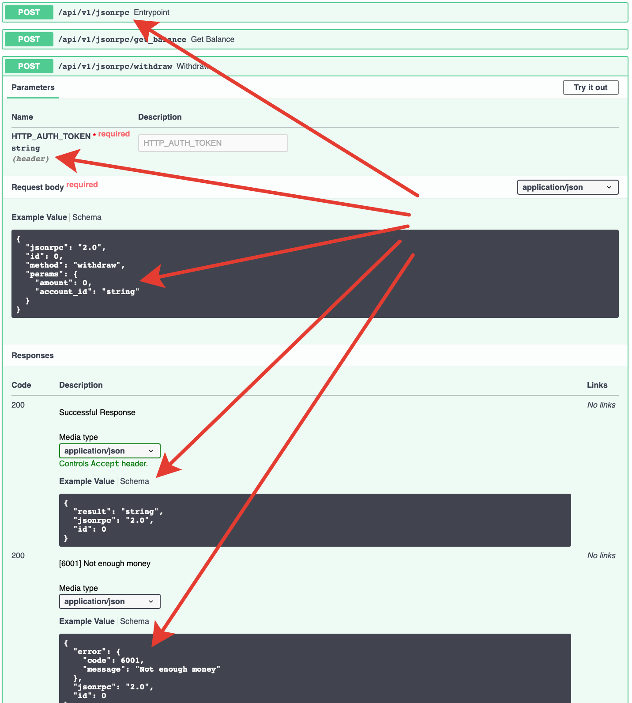

# fastapi-jsonrpc

[](https://github.com/smagafurov/fastapi-jsonrpc/actions/workflows/tests.yml)

JSON-RPC 2.0 server on top of [FastAPI](https://fastapi.tiangolo.com). Write JSON-RPC methods the same way you write FastAPI endpoints and get **OpenAPI**, **Swagger UI** and **OpenRPC** for free.



📚 **Documentation:** <https://smagafurov.github.io/fastapi-jsonrpc/>

## Install

```bash
pip install fastapi-jsonrpc
```

## Minimal example

```python
import fastapi_jsonrpc as jsonrpc
from pydantic import BaseModel
from fastapi import Body


app = jsonrpc.API()
api_v1 = jsonrpc.Entrypoint('/api/v1/jsonrpc')


class MyError(jsonrpc.BaseError):
    CODE = 5000
    MESSAGE = 'My error'

    class DataModel(BaseModel):
        details: str


@api_v1.method(errors=[MyError])
def echo(data: str = Body(..., examples=['hello'])) -> str:
    if data == 'error':
        raise MyError(data={'details': 'boom'})
    return data


app.bind_entrypoint(api_v1)


if __name__ == '__main__':
    import uvicorn
    uvicorn.run('app:app', port=5000, access_log=False)
```

Run it with `uvicorn` and open:

- `POST /api/v1/jsonrpc` — JSON-RPC endpoint
- `GET  /docs` — Swagger UI
- `GET  /openapi.json` — OpenAPI schema
- `GET  /openrpc.json` — OpenRPC schema

## Features

- All of FastAPI — `Depends`, `Body`, `Header`, `Cookie`, Pydantic models, async/await.
- Auto-generated OpenAPI and OpenRPC schemas.
- Typed errors with Pydantic `DataModel` included in the schema.
- Batch requests and notifications.
- Context-manager JSON-RPC middlewares.
- Optional Sentry integration (`fastapi_jsonrpc.contrib.sentry.FastApiJsonRPCIntegration`).
- Pytest plugin for capturing JSON-RPC errors in tests.

See the full docs at <https://smagafurov.github.io/fastapi-jsonrpc/>.

## Development

```bash
# Install dependencies
uv sync --frozen --group dev

# Run tests
uv run --frozen python -m pytest

# Run a single test
uv run --frozen python -m pytest tests/test_jsonrpc.py::test_name -x

# Change dependencies — edit pyproject.toml, then:
uv lock

# Build and publish
uv build
uv publish
```

## License

MIT — see [LICENSE](LICENSE).
