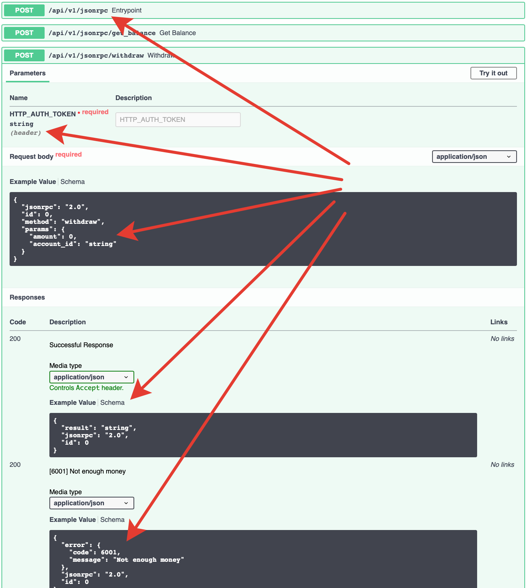

Description
===========

JSON-RPC server based on fastapi:

    https://fastapi.tiangolo.com

Motivation
^^^^^^^^^^

Autogenerated **OpenAPI** and **Swagger** (thanks to fastapi) for JSON-RPC!!!

Installation
============

.. code-block:: bash

    pip install fastapi-jsonrpc

Documentation
=============

Read FastAPI documentation and see usage examples bellow

Simple usage example
====================

.. code-block:: bash

    pip install uvicorn

example1.py

.. code-block:: python

    import fastapi_jsonrpc as jsonrpc
    from pydantic import BaseModel
    from fastapi import Body

    app = jsonrpc.API()

    api_v1 = jsonrpc.Entrypoint('/api/v1/jsonrpc')

    class MyError(jsonrpc.BaseError):
        CODE = 5000
        MESSAGE = 'My error'

        class DataModel(BaseModel):
            details: str

    @api_v1.method(errors=[MyError])
    def echo(
        data: str = Body(..., example='123'),
    ) -> str:
        if data == 'error':
            raise MyError(data={'details': 'error'})
        else:
            return data

    app.bind_entrypoint(api_v1)

    if __name__ == '__main__':
        import uvicorn
        uvicorn.run('example1:app', port=5000, debug=True, access_log=False)

Go to:

    http://127.0.0.1:5000/docs

FastAPI dependencies usage example
==================================

.. code-block:: bash

    pip install uvicorn

example2.py

.. code-block:: python

    from pydantic import BaseModel
    import fastapi_jsonrpc as jsonrpc
    from fastapi import Body, Header, Depends

    # database models

    class User:
        def __init__(self, name):
            self.name = name

        def __eq__(self, other):
            if not isinstance(other, User):
                return False
            return self.name == other.name

    class Account:
        def __init__(self, account_id, owner, amount, currency):
            self.account_id = account_id
            self.owner = owner
            self.amount = amount
            self.currency = currency

        def owned_by(self, user: User):
            return self.owner == user

    # fake database

    users = {
        '1': User('user1'),
        '2': User('user2'),
    }

    accounts = {
        '1.1': Account('1.1', users['1'], 100, 'USD'),
        '1.2': Account('1.2', users['1'], 200, 'EUR'),
        '2.1': Account('2.1', users['2'], 300, 'USD'),
    }

    def get_user_by_token(auth_token) -> User:
        return users[auth_token]

    def get_account_by_id(account_id) -> Account:
        return accounts[account_id]

    # schemas

    class Balance(BaseModel):
        """Account balance"""
        amount: int = Body(..., example=100)
        currency: str = Body(..., example='USD')

    # errors

    class AuthError(jsonrpc.BaseError):
        CODE = 7000
        MESSAGE = 'Auth error'

    class AccountNotFound(jsonrpc.BaseError):
        CODE = 6000
        MESSAGE = 'Account not found'

    class NotEnoughMoney(jsonrpc.BaseError):
        CODE = 6001
        MESSAGE = 'Not enough money'

        class DataModel(BaseModel):
            balance: Balance

    # dependencies

    def get_auth_user(
        # this will become the header-parameter of json-rpc method that uses this dependency
        auth_token: str = Header(
            None,
            alias='user-auth-token',
        ),
    ) -> User:
        if not auth_token:
            raise AuthError

        try:
            return get_user_by_token(auth_token)
        except KeyError:
            raise AuthError

    def get_account(
        # this will become the parameter of the json-rpc method that uses this dependency
        account_id: str = Body(..., example='1.1'),
        user: User = Depends(get_auth_user),
    ) -> Account:
        try:
            account = get_account_by_id(account_id)
        except KeyError:
            raise AccountNotFound

        if not account.owned_by(user):
            raise AccountNotFound

        return account

    # JSON-RPC entrypoint

    common_errors = [AccountNotFound, AuthError]
    common_errors.extend(jsonrpc.Entrypoint.default_errors)

    api_v1 = jsonrpc.Entrypoint(
        # Swagger shows for entrypoint common parameters gathered by dependencies and common_dependencies:
        #    - json-rpc-parameter 'account_id'
        #    - header parameter 'user-auth-token'
        '/api/v1/jsonrpc',
        errors=common_errors,
        # this dependencies called once for whole json-rpc batch request
        dependencies=[Depends(get_auth_user)],
        # this dependencies called separately for every json-rpc request in batch request
        common_dependencies=[Depends(get_account)],
    )

    # JSON-RPC methods of this entrypoint

    # this json-rpc method has one json-rpc-parameter 'account_id' and one header parameter 'user-auth-token'
    @api_v1.method()
    def get_balance(
        account: Account = Depends(get_account),
    ) -> Balance:
        return Balance(
            amount=account.amount,
            currency=account.currency,
        )

    # this json-rpc method has two json-rpc-parameters 'account_id', 'amount' and one header parameter 'user-auth-token'
    @api_v1.method(errors=[NotEnoughMoney])
    def withdraw(
        account: Account = Depends(get_account),
        amount: int = Body(..., gt=0, example=10),
    ) -> Balance:
        if account.amount - amount < 0:
            raise NotEnoughMoney(data={'balance': get_balance(account)})
        account.amount -= amount
        return get_balance(account)

    # JSON-RPC API

    app = jsonrpc.API()
    app.bind_entrypoint(api_v1)

    if __name__ == '__main__':
        import uvicorn
        uvicorn.run('example2:app', port=5000, debug=True, access_log=False)

Go to:

    http://127.0.0.1:5000/docs

Development
===========

* Install poetry

    https://github.com/sdispater/poetry#installation

* Install dephell

    .. code-block:: bash

        pip install dephell

* Install dependencies

    .. code-block:: bash

        poetry update

* Regenerate README.rst

    .. code-block:: bash

        rst_include include -s README.src.rst -t README.rst -q

* Change dependencies

    Edit ``pyproject.toml``

    .. code-block:: bash

        poetry update
        dephell deps convert

* Bump version

    .. code-block:: bash

        poetry version
        dephell deps convert

* Publish to pypi

    .. code-block:: bash

        poetry publish --build

