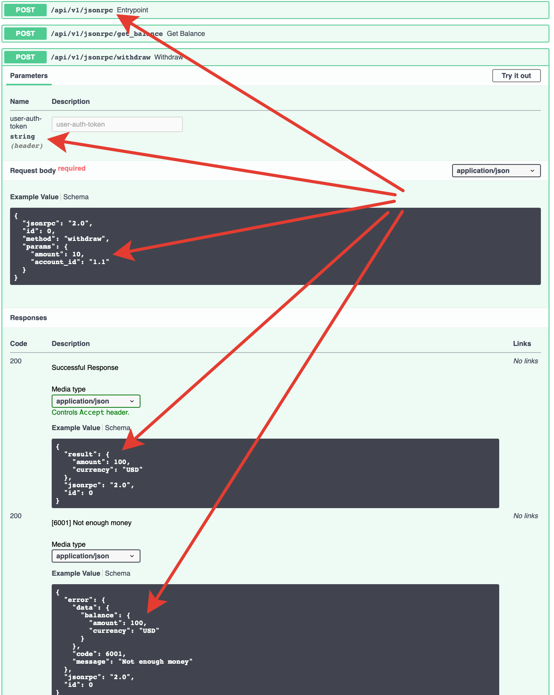

# fastapi-jsonrpc

JSON-RPC 2.0 server built on top of [FastAPI](https://fastapi.tiangolo.com). Write JSON-RPC methods the same way you write FastAPI endpoints — with Pydantic models, dependency injection, typed parameters and async support — and get **OpenAPI**, **Swagger UI** and **OpenRPC** for free.



```python
import fastapi_jsonrpc as jsonrpc
from fastapi import Body

app = jsonrpc.API()
api_v1 = jsonrpc.Entrypoint('/api/v1/jsonrpc')


@api_v1.method()
def echo(data: str = Body(..., examples=['hello'])) -> str:
    return data


app.bind_entrypoint(api_v1)
```

Run it with `uvicorn` and open:

- `POST /api/v1/jsonrpc` — JSON-RPC endpoint
- `GET  /docs` — Swagger UI
- `GET  /openapi.json` — OpenAPI schema
- `GET  /openrpc.json` — OpenRPC schema

## Why fastapi-jsonrpc

- **All of FastAPI.** `Depends`, `Body`, `Header`, `Cookie`, Pydantic models, `async`/`await`, lifespans, background tasks — everything works the same way inside a JSON-RPC method.
- **Auto-generated schemas.** Each method appears as a regular POST route in the OpenAPI schema, so Swagger UI lets you call methods interactively. OpenRPC schema is generated alongside.
- **Typed error model.** Errors are plain Python classes with a `CODE`, `MESSAGE` and an optional Pydantic `DataModel`. They end up in the schema automatically.
- **Batch requests & notifications.** Full JSON-RPC 2.0 support — batches, notifications, per-request dependencies.
- **JSON-RPC middlewares.** Context manager based middlewares with access to the raw request, the raw response and the exception (if any).
- **Sentry integration.** Optional integration that reports the JSON-RPC method name as the transaction and keeps one Sentry transaction per batch with a span per method.

## Where to start

- [Installation](installation.md) — install the package.
- [Quickstart](quickstart.md) — a minimal working example in under a minute.
- [Methods & parameters](usage/methods.md) — how to declare JSON-RPC methods.
- [Errors](usage/errors.md) — custom errors with typed `DataModel`.
- [Dependencies](usage/dependencies.md) — reuse FastAPI dependencies, including per-batch and per-request.
- [Middlewares](usage/middlewares.md) — cross-cutting concerns around every call.
- [OpenAPI & OpenRPC](usage/openapi.md) — schemas and interactive docs.
- [Sentry](usage/sentry.md) — tracing and error reporting.

!!! tip "Looking for deeper details?"
    A machine-readable, full-detail bundle will be published as `llms-full.txt` alongside this site. It is intended for LLMs and for offline reading — this site keeps only the essentials.
